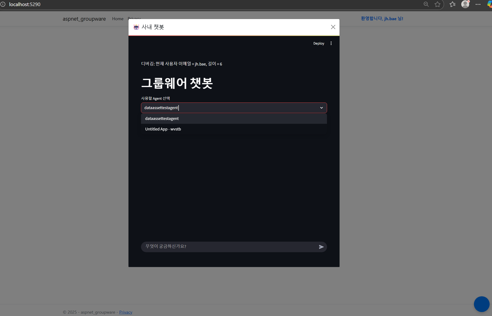

## 그룹웨어를 예시로 ASP.NET 기본앱 구성하여 팝업 채팅 테스트

### 1. Ctrl+Shift+` 를 눌러 터미널창을 열고 03.sampleapp\aspnet_groupware 경로로 이동해서 dotnet run 실행
###    - info: Microsoft.Hosting.Lifetime[14]
###    - Now listening on: http://localhost:5290
###    - 이렇게 뜨면 http://localhost:5290로 접속

### 2. 새로운 터미널을 열어서 app.py를 streamlit으로 실행 ex) streamlit run app.py

### 참고로 Embedding 소스는 aspnet_groupware\Pages\Shared\_Layout.cshtml 참고

